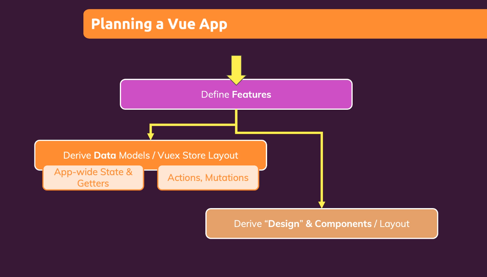
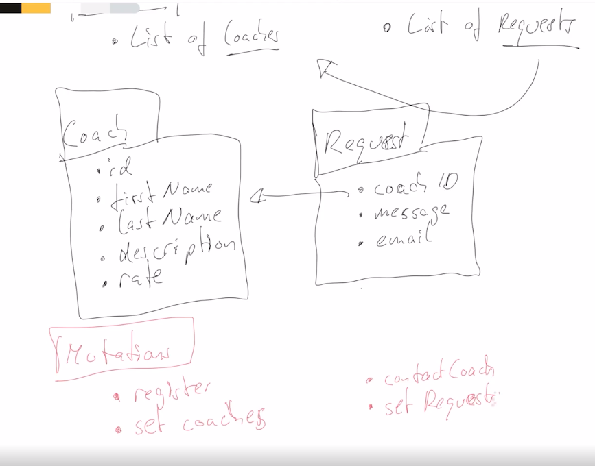
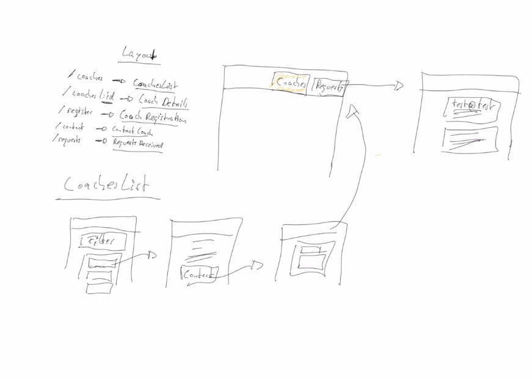
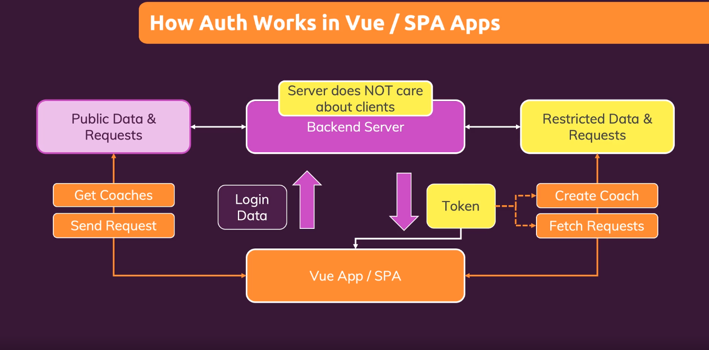
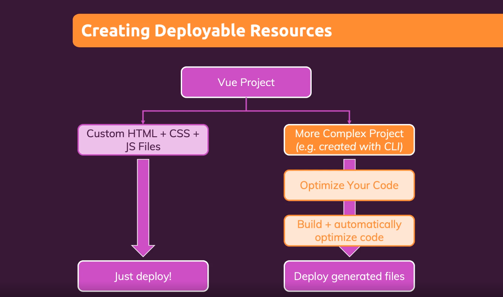
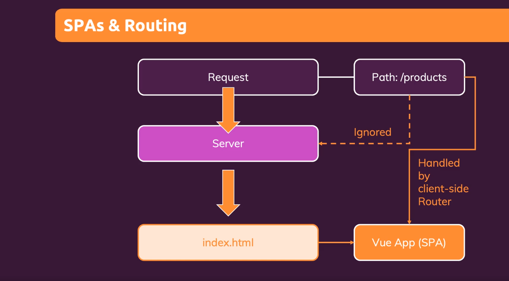

## Planning a Vue App
    

   
------  
## Data
  

   
------  
## Layout
  

   
------  

------  
## Auth in Vue / SPA Apps
  

Read more about Firebase auth<a href="https://firebase.google.com/docs/reference/rest/auth">https://firebase.google.com/docs/reference/rest/auth</a>

   
------  

------  
## Creating Deployable Resources
  

   
------  

------  
## SPA's & Routing
  

   
------  

### 02 main features:
- find a coach
- send a message to potential coaches
- auth

## Live at
<a href="https://find-a-coach-vue-2a71e.web.app/coaches" target="_blank">https://find-a-coach-vue-2a71e.web.app/coaches</a> 